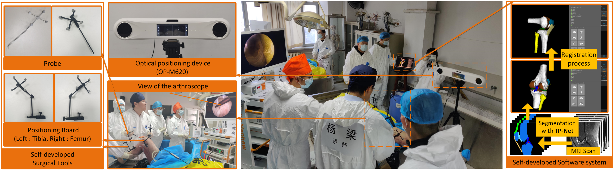

# 
Reliable Multi-Prototypical Contrastive Learning for Semi-supervised Heterogeneous Medical Image Segmentation

Jieshu Ren1,2, Liang Yang3, Hongyu Lin1,2, Yichao Wangn1,2, Dongpei Liu3, Yi Wang1, Zhihui WangYi Wang1, and Bin Liun1,2,*

Dalian University of Technology, China1 Cancer Hospital of Dalian University of Technology, China2 The Second Hospital of Dalian Medical University, China3

## Abstract

Accurate multi-organ segmentation is pivotal for clinical decision-making in diagnosis. 

However, two fundamental challenges persist: (1)inter-class feature indistinctness, and (2) high multi-source sample heterogeneity, particularly under semi-supervised learning with limited annotations. 

In this paper, we propose TP-Net, a semi-supervised framework for multi-organ segmentation in heterogeneous medical images, which innovatively integrates reliable multi-prototype contrastive learning. Specifically, to mitigate prototype shift, we first devise an uncertainty-aware cross-domain alignment strategy grounded in the smoothness assumption, which constructs reliable prototypes by propagating reliable predictions distributions from labeled to unlabeled domains. This is synergized with contrastive separation, enforceing feature-proximity to class-matched prototypes in the embedding space. In order to further model the intricate distributions of multi-source samples, the heterogeneous prototype dynamic evolution mechanism with the multi-prototype embedding space is proposed. 

Experimental results on two public and one in-house datasets prove that the proposed method achieves a state-of-the-art performance. Further, clinical validation with  our self-developed surgical navigation system demonstrated the clinical viability of the proposed method.

## Motivation

Fig 1. Graphical Abstract

 
Two major challenges in multi-organ segmentation:
> - **Inter-class feature indistinctness**:The features of multiple organs with highly similar characteristics (e.g., texture, anatomical structures, contrast) remain challenging to distinguish, as illustrated in Fig.1(Challenge1). Additionally, the complexity of medical image backgrounds introduces substantial ambiguous pixels, particularly at organ boundaries and within low-contrast regions.
> - **High multi-source sample heterogeneity**:The inherent multi-source heterogeneity in medical datasets, originating from multi-institutional and multi-scanner acquisition protocols, leads to low intra-class consistency within identical classes in the same dataset, as shown in Fig.1(Challenge2).

Furthermore, due to the time-consuming and expensive manual contouring process when labeling medical images, many attempts have been made towards semi-supervised learning (SSL), particularly through pseudo-label refinement strategies. 

<video src="Figures/VID 20250505001043957.mp4" controls="controls" width="500" height="300"></video>

<video width="320" height="240" controls>
<source src="movie.mp4" type="Figures/VID 20250505001043957.mp4">
</video>

## Experiment
### Comparison to SOTA Methods

Tab 1. Comparison between our method and existing methods on SPIDER dataset.

 

.png)

Fig 2. Qualitative results of different segmentation methods on SPIDER dataset.

 

Tab 2. Comparison between our method and existing methods on Abdomenct-1k dataset.

 

.png)

Fig 3. Qualitative results of different segmentation methods on Abdomenct-1k dataset.

 

Tab 3. Comparison between our method and existing methods on Knee dataset.

 

.png)

Fig 4. Qualitative results of different segmentation methods on Knee dataset.

 

### Clinical Application

To further validate the effectiveness of our method in clinical applications, we independently developed a surgical navigation system for minimally invasive knee surgeries with arthroscopy, where the optimal model weights of our proposed TP-Net on the knee dataset were deployed for semantic segmentation of knee MRI scans. We can obtain a 3D reconstruction model based on the segmentation results from inference, which will be used for visualizing the knee joint model in this system, aiming to improve the success rate and safety of the surgery. Before showing the results of our clinical trials, we first introduce minimally invasive knee surgeries with arthroscopy. Minimally invasive knee surgery is a common treatment for knee joint injuries or related diseases, which aims to complete the treatment by arthroscopy with only small incisions. However, due to the limitation of view of the arthroscope, clinicians can not accurately observe the internal condition of the patient's knee joint, which can potentially lead to surgical failure. The surgical navigation system can effectively address this issue by using several algorithms to obtain an accurate visualization model of the patient's knee joint, and real-time tracking and positioning technology to reflect the joint's motion state in the visualization model.

Hence, we independently developed a surgical navigation system for minimally invasive knee surgeries (including the software system and related surgical tools such as probes and positioning boards), which is supported by an optical positioning device, OP-M620 (provided by Guangzhou Aimooe Technology Co., Ltd.). We combined traditional semantic segmentation algorithms to obtain the patient's 3D bone model from CT images. Considering that there are no clear displays of soft tissues in CT images like cartilage, we deploy the optimal model weights of TP-Net into our system, which allows clinicians to input the patient's MRI scans and then obtain the 3D MRI visualization. We combined the soft tissue of the 3D MRI visualization with the 3D bone model to create a complete 3D visualization model for our system with RANSAC algorithm. Additionally, we designed a registration approach for minimally invasive knee surgeries with the OP-M620 and our self-developed tools (e.g., a probe and two positioning boards), which makes the connection between the visualization model and the patient's knee joint, allowing the patient's knee movement to be accurately and real-time reflected in the visualization model of our system.
With the assistance of clinicians, we completed two clinical trials, performing minimally invasive knee surgeries on cadavers using our surgical navigation system at Dalian Medical University. As shown in Fig.\ref{fig:clinical_trial}, the results of clinical trials fully validate that our proposed TP-Net can be successfully applied in medical scenarios and effectively address clinical challenges.
  

Fig 4. Clinical trial conducted at Dalian Medical University on December 15, 2024. The branches in the figure illustrate the details of our surgical navigation system for minimally invasive knee surgery, including our self-developed software system, our self-developed related surgical tools (e.g., two probes and two positioning boards), and the optical positioning device OP-M620. Note that this result was captured after the registration process was completed, and we deployed the optimal model weights of our proposed TP-Net on the knee dataset into the software system for semantic segmentation of knee MRI scans.

 
  
## Discussion

Fig 4. Dice performance with different loss weights &lambda;T and &lambda;P using 5%, 10%, and 20% labeled data.

 

## Acknowledgement
